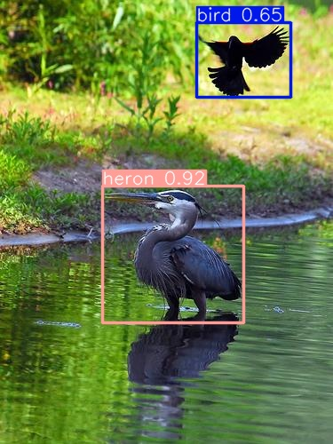

# Predator Detection

This project includes scripts, models, and related tools aimed at accurately identifying herons and, later, raccoons from a video feed. My training and test scripts will be added and refined over time.

## Project Overview

- **classes.txt:**  
  Contains the standard 80 COCO classes with three additional classes: 'heron', 'raccoon' and 'background'.

- **`weights/`:**  
  These files represent the results from my latest YOLOv10 training run. The model was first trained on the standard 80 COCO classes. Afterward, I combined several datasets of heron images and specific bird species (all recategorized into the standard 'bird' class except for herons and similar species), and appended the standard classes with 'heron' and 'raccoon'. Initially, when I used only the standard classes plus herons, most birds were misclassified as herons during testing. The current model now differentiates them much more accurately. (Refer to the included image for an example.)

- **capture-background-frames.py:**  
  A simple script to capture a specified number of static/background images from an RTSP stream. These images provide a baseline for detection and help in highlighting the appearance of new objects in the frame.

- **sample.jpg:**

  
