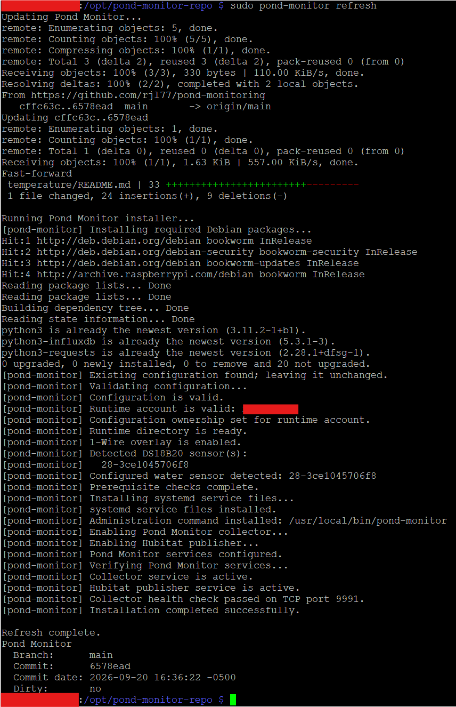
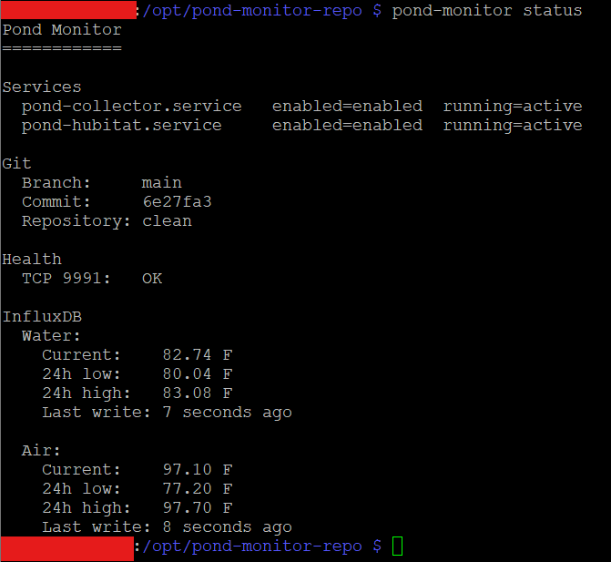
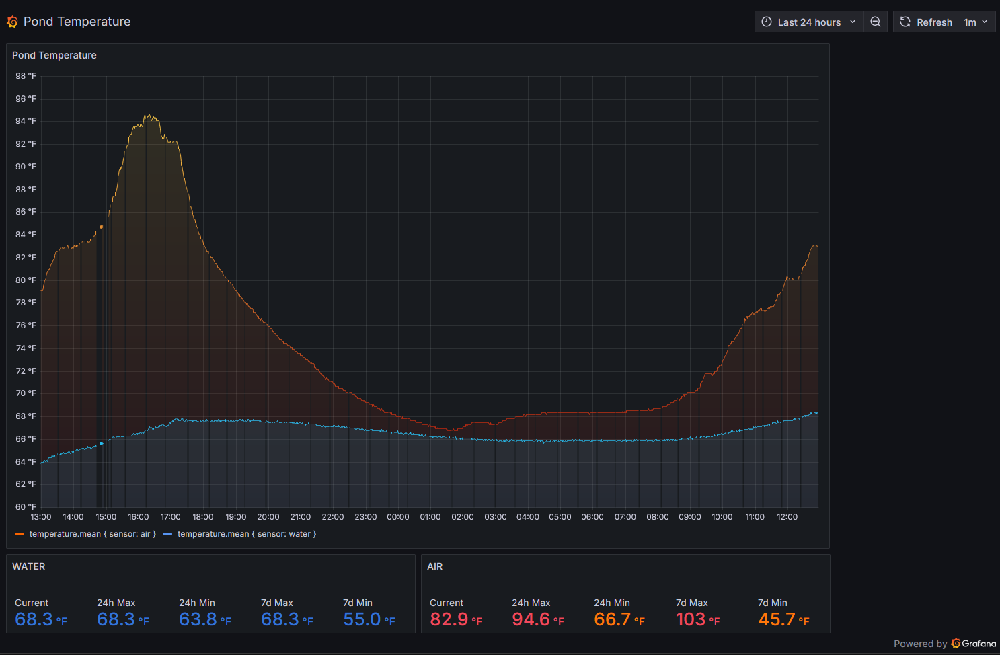
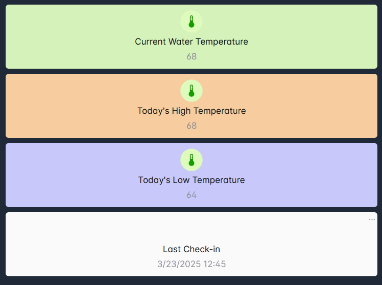

# Pond Monitor

Pond Monitor is a Raspberry Pi-based environmental monitoring system for a
backyard pond.

At present, it collects water temperature from a DS18B20 1-Wire sensor and writes 
readings to InfluxDB. Air temperature can optionally be obtained from Hubitat or a 
local DHT22 sensor (DS18B20 sensors don't give accurate readings in sunlight).

A separate, optional Hubitat publisher reads the rolling 24-hour water
temperature statistics from InfluxDB and publishes the current, high, low, and
update time to Hubitat devices.

Pond Monitor includes a `pond-monitor` administration command that provides a
single interface for routine operation and maintenance. It reports application
and sensor status, displays logs, identifies the deployed Git version, reruns
the installer, and safely pulls and deploys updates from Git.

## Architecture

```text
DS18B20
   |
   v
Pond Collector ----------------------+
   |                                 |
   +----> InfluxDB                   |
   |                                 |
   +----> Offline journal            |
          (during Influx failure)     |
                                     |
Hubitat air-temperature device ------+
        optional input


InfluxDB
   |
   v
Hubitat Publisher
   |
   +----> Current water temperature
   +----> 24-hour high
   +----> 24-hour low
   +----> Last-updated timestamp
```

The collector and Hubitat publisher are separate processes. The collector is
the core application; Hubitat publishing is an optional integration.

## Project Layout

```text
pond-monitor/
├── config/
│   ├── pond.env.example
│   └── pond.env                 # local, Git-ignored
├── docs/
│   ├── INSTALL.md
│   ├── OPERATIONS.md
│   └── TROUBLESHOOTING.md
├── runtime/
│   └── sensor_journal.log       # created at runtime, Git-ignored
├── src/
│   ├── collector.py
│   ├── hubitat.py
│   └── pond/
├── systemd/
│   ├── pond-collector.service
│   ├── pond-hubitat.service
│   └── pond-network-watchdog.service
├── tools/
│   ├── network-watchdog
│   └── pond-monitor
├── .gitignore
├── install.sh
├── README.md
└── requirements.txt
```

`config/pond.env` contains machine-local configuration and secrets and is not
stored in Git.

Files under `runtime/` contain local runtime state and are also excluded from
Git.

## Services

The installed systemd services are:

```text
pond-collector.service
pond-hubitat.service
```

The collector normally runs one collection cycle every 60 seconds.

The Hubitat publisher normally publishes every 15 minutes and can be disabled
independently.

## Reliability

The collector is designed to continue operating through temporary network or
InfluxDB failures.

If InfluxDB is unavailable, sensor readings are written to a local newline-JSON
journal. When InfluxDB becomes available again, queued readings are written
back to the database.

Each collection cycle runs in a separate child process with a timeout so that
a blocked sensor or network operation cannot permanently hang the collector.

A lightweight TCP health listener is provided on the configured health port
(default: 9991).

## Installation

See `docs/INSTALL.md` for initial deployment instructions.

For a fresh installation, run:

```bash
cd /opt/pond-monitor
sudo ./install.sh
```

After installation, use the included administration command for normal maintenance:

```bash
sudo pond-monitor install
sudo pond-monitor refresh
```

Use `install` after local configuration changes. Use `refresh` to pull and
deploy application updates from Git.

## Operations

See `docs/OPERATIONS.md` for service management, logs, health checks, and
normal maintenance.

## Troubleshooting

See `docs/TROUBLESHOOTING.md` for sensor, network, InfluxDB, journaling,
Hubitat, and systemd troubleshooting.

## Examples

### Refresh via `pond-monitor refresh`



### Status check via `pond-monitor status`



### Grafana



### Hubitat


